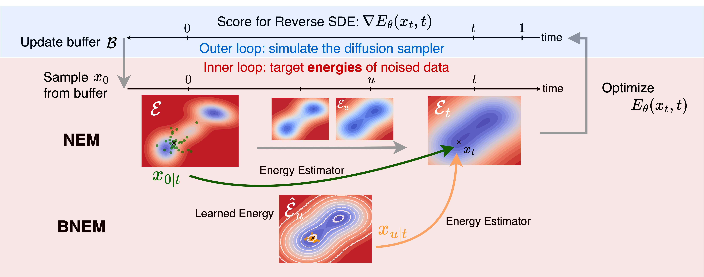

# BNEM: A Boltzmann Sampler Based on Bootstrapped Noised Energy Matching


[](https://arxiv.org/abs/2409.09787)

This is the official repository of the paper [BNEM: A Boltzmann Sampler Based on Bootstrapped Noised Energy Matching](https://arxiv.org/abs/2409.09787).

In this paper, we first introduce NEM, which targets the marginal energy estimator at each noise level based on the target/system energy. We then introduce BNEM, which targets energy estimators with smaller variance based on bootstrapping.



## Installation


```bash

# create micromamba environment
conda env create -f environment.yaml
conda activate bnem

# install requirements
pip install -r requirements.txt

```

## Run experiments
To run an experiment and log it to WandB, e.g., GMM with NEM, you can run on the command line

```bash
export WANDB_ENTITY=<your_wandb_entity>
python dem/train.py experiment=gmm_nem model=nem
```
you could modify `configs/logger/wandb.yaml` to customize your wandb.

Here's the list of available models:

    - dem: iDEM
    - dem_en: iDEM with an energy parameterisation
    - nem: NEM
    - bnem: BNEM

## Citation

If you find our paper, code, and/or data useful for your research, please cite our paper:

```
@misc{ouyang2025bnemboltzmannsamplerbased,
      title={BNEM: A Boltzmann Sampler Based on Bootstrapped Noised Energy Matching}, 
      author={RuiKang OuYang and Bo Qiang and Zixing Song and José Miguel Hernández-Lobato},
      year={2025},
      eprint={2409.09787},
      archivePrefix={arXiv},
      primaryClass={cs.LG},
      url={https://arxiv.org/abs/2409.09787}, 
}
```

<!-- 
To evaluate the sampled results for NLL and ESS, you need to modify the energy yaml file to your sampled datapoints:

```bash
data_path_train: "<your_save_path_for_generated_samples>/samples_100000.pt"
data_path_val: ${energy.data_path_train}
```

and also modify the model yaml file:

```bash
#turn on the below 3 config for eval mode
nll_with_cfm: true
# train cfm only on train data and not dem
debug_use_train_data: true
logz_with_cfm: true
```

At last, run:
```bash
python dem/eval.py experiment=gmm_idem
``` -->
